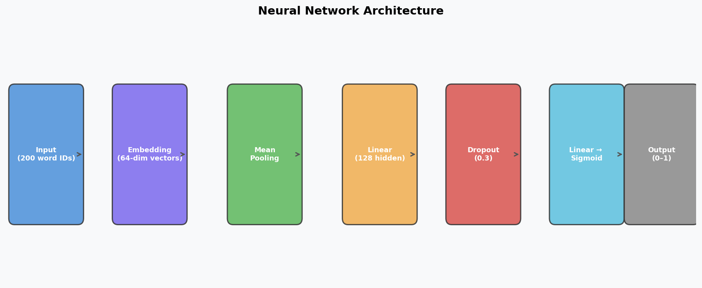
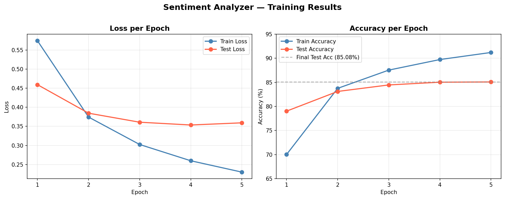

# 🎬 Sentiment Analyzer — Neural Network

A neural network built from scratch in PyTorch that reads movie reviews and classifies them as **positive** or **negative**. Trained on 25,000 real IMDB reviews, achieving **85.08% accuracy** on unseen data.

---

## 📋 Project Overview

This project takes raw text as input, processes it through an embedding-based neural network, and outputs a sentiment prediction with a confidence score.

```
"This movie was absolutely incredible!" → POSITIVE 😊 (96.3% confidence)
"What a waste of time. Terrible plot."  → NEGATIVE 😞 (94.1% confidence)
```

---

## 🧠 How It Works

Text can't be fed directly into a neural network — computers only understand numbers. The model processes text through this pipeline:

```
Raw Text
   ↓
Tokenize         → ["this", "movie", "was", "great"]
   ↓
Vocabulary       → [11, 27, 8, 84]      (each word gets a unique ID)
   ↓
Embedding        → [[0.2, 0.8, ...], ...]  (each ID → 64-number meaning vector)
   ↓
Mean Pooling     → average all word vectors into one review vector
   ↓
Neural Network   → 0.96  →  POSITIVE ✅
```

The **embedding layer** is the key insight — words with similar meanings (like "great" and "amazing") end up with similar vectors, which is how the model understands language.

---

## 🏗️ Architecture



| Layer                | Details                                                    |
| -------------------- | ---------------------------------------------------------- |
| **Embedding**        | 10,000 vocab × 64 dimensions = 640,000 parameters          |
| **Mean Pooling**     | Averages 200 word vectors → single 64-dim review vector    |
| **Linear (fc1)**     | 64 → 128 hidden units                                      |
| **ReLU**             | Non-linear activation function                             |
| **Dropout (0.3)**    | Randomly disables 30% of neurons to prevent overfitting    |
| **Linear (fc2)**     | 128 → 1 output                                             |
| **Sigmoid**          | Squishes output to 0–1 (probability of positive sentiment) |
| **Total Parameters** | **648,449**                                                |

---

## 📊 Training Results

Trained for 5 epochs on 25,000 IMDB reviews with a batch size of 64.



| Epoch | Train Loss | Train Acc | Test Loss | Test Acc   |
| ----- | ---------- | --------- | --------- | ---------- |
| 1     | 0.5748     | 70.02%    | 0.4595    | 79.02%     |
| 2     | 0.3744     | 83.75%    | 0.3846    | 83.11%     |
| 3     | 0.3024     | 87.54%    | 0.3609    | 84.46%     |
| 4     | 0.2597     | 89.73%    | 0.3536    | 85.03%     |
| 5     | 0.2299     | 91.20%    | 0.3593    | **85.08%** |

**Note:** The gap between train (91.2%) and test (85.08%) accuracy is called **overfitting** — the model begins memorizing training reviews rather than purely learning patterns. The dropout layer slows this down but doesn't eliminate it entirely.

---

## 📁 Project Structure

```
Sentiment-Analyzer/
├── sentiment.py        # Main model, training, and prediction code
└── README.md
```

---

## 🚀 How to Run

```bash
# Create a virtual environment
python3 -m venv .venv
source .venv/bin/activate

# Install dependencies
pip install torch datasets numpy matplotlib

# Run the model
python3 sentiment.py
```

---

## 🛠️ Tech Stack

- **Python 3.12**
- **PyTorch** — neural network definition and training
- **Hugging Face datasets** — IMDB dataset loading
- **NumPy** — numerical operations
- **Matplotlib** — training visualization

---

## 🧪 Example Predictions

```
Review: This movie was absolutely incredible. The acting was superb...
Result: POSITIVE 😊 (confidence: ~96%)

Review: What a waste of time. The plot made no sense and the acting was terrible...
Result: NEGATIVE 😞 (confidence: ~94%)

Review: It was okay I guess, nothing special but not horrible either...
Result: (near 50% — ambiguous, as expected)
```

---

## 🧠 Concepts Covered

- Text tokenization and vocabulary building
- Word embeddings
- Mean pooling
- Binary cross-entropy loss
- Backpropagation and gradient descent
- Dropout regularization
- Overfitting vs generalization

---

## 🔮 Next Steps

- **LSTM / GRU** — recurrent layers that process word order, not just averages
- **Pre-trained embeddings** — use GloVe or Word2Vec instead of training from scratch
- **Transformer (BERT)** — fine-tune a pre-trained model for 92%+ accuracy
- **Larger vocabulary** — increase from 10,000 to 50,000 words
